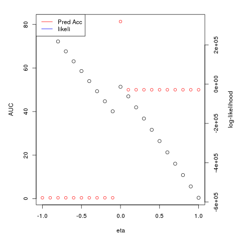
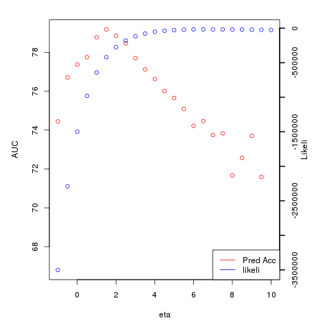
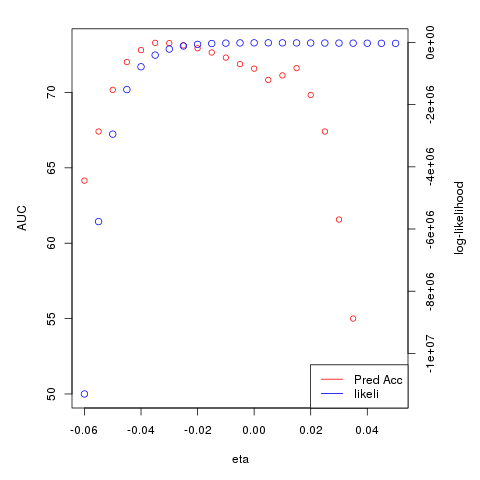
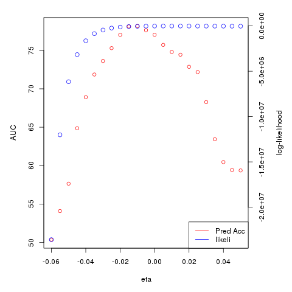
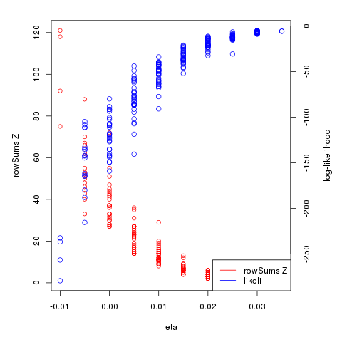

# General Analysis of different type of tree rescaling

## Settings
Testing AUC results when using the option `ALL` in rocCurves, without using any cross validation

## Lambda transformation - Self coding in R


```r
load('comGMPD.RData')
com=unname(com)
phy_dist = unname(phy_dist)
Z= 1*(com>0)
dist = phy_dist
dd = 1/dist
diag(dd)<-0
m = max(dd)
##diag(dd)<-max(dd)
dd1= (dd/max(dd) - 1)%*%Z + Z           # removed circular reference with + Z
Zmc = matrix(colSums(Z), nrow(Z), ncol(Z), byrow=TRUE) - Z # removed circular reference

grid=seq(0,1,0.1)
aux =sapply(grid, function(eta){
    pdist= Zmc/(Zmc + eta*dd1)
    P = 1-exp(-pdist)
    roc = rocCurves(Z=Z, Z_cross= Z, P=P, plot=FALSE, bins=400, all=TRUE)
    tb  = ana.table(Z, Z, roc=roc, plot=FALSE)
    cbind(eta=eta, tb=tb)
    })
        
plot(unlist(aux['eta',]), unlist(aux['tb.auc',]), ylab = 'AUC', xlab='parameter')

```

| Data   | AUC max | Pred all max |
|--------|---------|--------------|
| GMPD   |   81.43 |        0.869 |
| EID-PS |   82.77 |         0.76 |


### Lambda transform using geiger


```r
library(geiger)
load('comGMPD.RData')
tree <- read.tree('../Data/mammals.tre')
tree <- drop.tip(tree, tree$tip.label[!tree$tip.label %in% rownames(com)])
Z= 1*(com>0)

grid=seq(0.1,1,0.05)
aux =sapply(grid, function(eta){
    print(eta)
    phy_dist<- cophenetic(rescale(rescale(tree, "lambda", eta), "depth", depth=1))
    phy_dist = dist_ordering(phy_dist, com)
    dd =1/(phy_dist)
    diag(dd)<-0
    pdist = dd %*% Z
    P = 1-exp(-pdist)
    roc = rocCurves(Z=Z, Z_cross= Z, P=P, plot=FALSE, bins=400, all=TRUE)
    tb  = ana.table(Z, Z, roc=roc, plot=FALSE)
    cbind(eta=eta, tb=tb)
})

png('img/lambda_trans_GMP-geiger.png')
plot(unlist(aux['eta',]), unlist(aux['tb.auc',]), ylab = 'AUC', xlab='parameter')
dev.off()

```

| Data   | AUC max | Pred all max | eta | 
|--------|---------|--------------|-----|
| GMPD   |   81.36 |        0.71 | 1 | 
| EID-PS |   81.38 |         0.71 | 1 |


## Kappa transformation


```r
load('comGMPD.RData')
tree <- read.tree('../Data/mammals.tre')
tree <- drop.tip(tree, tree$tip.label[!tree$tip.label %in% rownames(com)])
Z= 1*(com>0)

grid=seq(0,4,0.1)
aux =sapply(grid, function(eta){
    phy_dist<- cophenetic(rescale(rescale(tree, "kappa", eta), "depth", depth=1))
    phy_dist = dist_ordering(phy_dist, com)
    dd =1/phy_dist
    diag(dd)<-0
    pdist = dd %*%Z
    P = 1-exp(-pdist)
    roc = rocCurves(Z=Z, Z_cross= Z, P=P, plot=FALSE, bins=400, all=TRUE)
    tb  = ana.table(Z, Z, roc=roc, plot=FALSE)
    cbind(eta=eta, tb=tb)
})

png('img/kappa_trans_GMP-geiger.png')
plot(unlist(aux['eta',]), unlist(aux['tb.auc',]), ylab = 'AUC', xlab='parameter')
dev.off()

```


| Data   | AUC max | Pred all max | eta |
|--------|---------|--------------|-----|
| GMPD   |    82.6 |        0.695 | 1.7 |
| EID-PS |   80.19 |         0.73 | 1.7 |


Kappa geiger


## BM transformation


```r
library(geiger)
source('library.R')
load('comGMPD.RData')
tree <- read.tree('../Data/mammals.tre')
tree <- drop.tip(tree, tree$tip.label[!tree$tip.label %in% rownames(com)])

grid=seq(0.1,4,0.1)
Z= 1*(com>0)
aux =sapply(grid, function(eta){
    print(eta)
    phy_dist<- cophenetic(rescale(rescale(tree, "BM", eta), "depth", depth=1))
    phy_dist = dist_ordering(phy_dist, com)
    dd =1/phy_dist
    diag(dd)<-0
    pdist = dd %*% Z
    P = 1-exp(-pdist)
    roc = rocCurves(Z=Z, Z_cross= Z, P=P, plot=FALSE, bins=400, all=TRUE)
    tb  = ana.table(Z, Z, roc=roc, plot=FALSE)
    cbind(eta=eta, tb=tb)
})

png('img/BM_trans_GMP-geiger.png')
plot(unlist(aux['eta',]), unlist(aux['tb.auc',]), ylab = 'AUC', xlab='parameter')
dev.off()
```


| Data   | AUC max | Pred all max | eta |
|--------|---------|--------------|-----|
| GMPD   |    81.66 |        0.71 | 2.4 |


## OU transformation


```r
library(geiger)
source('library.R')
load('comGMPD.RData')
tree <- read.tree('../Data/mammals.tre')
tree <- drop.tip(tree, tree$tip.label[!tree$tip.label %in% rownames(com)])

grid=seq(0.1,4,0.1)
Z= 1*(com>0)
aux =sapply(grid, function(eta){
    print(eta)
    phy_dist<- cophenetic(rescale(rescale(tree, "OU", eta), "depth", depth=1))
    phy_dist = dist_ordering(phy_dist, com)
    dd =1/phy_dist
    diag(dd)<-0
    pdist = dd %*% Z
    P = 1-exp(-pdist)
    roc = rocCurves(Z=Z, Z_cross= Z, P=P, plot=FALSE, bins=400, all=TRUE)
    tb  = ana.table(Z, Z, roc=roc, plot=FALSE)
    cbind(eta=eta, tb=tb)
})

png('img/OU_trans_GMP-geiger.png')
plot(unlist(aux['eta',]), unlist(aux['tb.auc',]), ylab = 'AUC', xlab='parameter')
dev.off()
```


## EB transformation

```r
library(geiger)
source('library.R')
load('comGMPD.RData')
tree <- read.tree('../Data/mammals.tre')
tree <- drop.tip(tree, tree$tip.label[!tree$tip.label %in% rownames(com)])

grid=seq(-.05,0.05,0.001)
Z= 1*(com>0)
aux =sapply(grid, function(eta){
    print(eta)
    phy_dist<- cophenetic(rescale(rescale(tree, "EB", eta), "depth", depth=1))
    phy_dist = dist_ordering(phy_dist, com)
    dd =1/phy_dist
    diag(dd)<-0
    pdist = dd %*% Z
    P = 1-exp(-pdist)
    roc = rocCurves(Z=Z, Z_cross= Z, P=P, plot=FALSE, bins=400, all=TRUE)
    tb  = ana.table(Z, Z, roc=roc, plot=FALSE)
    cbind(eta=eta, tb=tb)
})

png('img/EB_trans_GMP-geiger.png')
plot(unlist(aux['eta',]), unlist(aux['tb.auc',]), ylab = 'AUC', xlab='parameter')
dev.off()

```


| Data   | AUC max | Pred all max | eta |
|--------|---------|--------------|-----|
| GMPD   |    84.09 |        0.77 | -0.025 |


## EB transformation - depth 1000

```r
library(geiger)
source('library.R')
load('comGMPD.RData')
tree <- read.tree('../Data/mammals.tre')
tree <- drop.tip(tree, tree$tip.label[!tree$tip.label %in% rownames(com)])

grid=seq(-.05,0.05,0.001)
Z= 1*(com>0)
aux =sapply(grid, function(eta){
    print(eta)
    phy_dist<- cophenetic(rescale(rescale(tree, "EB", eta), "depth", depth=1000))
    phy_dist = dist_ordering(phy_dist, com)
    dd =1/phy_dist
    diag(dd)<-0
    pdist = dd %*% Z
    P = 1-exp(-pdist)
    roc = rocCurves(Z=Z, Z_cross= Z, P=P, plot=FALSE, bins=400, all=TRUE)
    tb  = ana.table(Z, Z, roc=roc, plot=FALSE)
    cbind(eta=eta, tb=tb)
})

png('img/EB_trans_GMP-geiger_depth1000.png')
plot(unlist(aux['eta',]), unlist(aux['tb.auc',]), ylab = 'AUC', xlab='parameter')
dev.off()

plot(rescale(tree,"depth",depth=1000))

```

EB with tree scaled to depth of 1000


# Testing ICM likelihood for dist only model


```r
load('~/Github/ICM/comGMPD.RData')
tree <- read.tree('~/Github/Data/mammals.tre')
tree <- drop.tip(tree, tree$tip.label[!tree$tip.label %in% rownames(com)])

# Testing all names in hosts in com exist in tree
if(! all(sapply(rownames(com), function(r) r %in% tree$tip.label))) {
		print('Warning! Not all hosts in com exist in tree. Hosts not found in tree will be removed.')
		com <- com[rownames(com)%in%tree$tip.label,]
}

source('library.R')
source('gen.R')
dd = cophenetic(rescale(tree, 'EB', 0))
aux <- sapply(rownames(dd), function(r) which(r==rownames(com)))
com = com[aux,]
Z= unname(com)
Z = 1*(Z>0)
tree = rescale(tree, 'depth',1)

tree.ht = arrange.tree(tree)
grid=seq(0, 10,.01)
aa = sapply(1:nrow(Z), function(i){
aux =sapply(grid, function(eta){
    print(eta)
    pdist.new = cophenetic(eb.phylo(tree, tree.ht, eta))
    pdist.new =1/pdist.new
    diag(pdist.new)<-0
    pdist.new = c(pdist.new[i,]%*% Z)
    U <- rExp.mean(pdist.new)
    U[Z[i,]==0]<-1
    likeli = sum(log(pdist.new)*Z[i,] ) - sum(U*(pdist.new))
    likeli1 = sum(log(pdist.new)*Z[i,] )
    likeli3= -sum(U*(pdist.new))
    c(eta,likeli, likeli1, likeli3, range(pdist.new))
})
aux[,which.max(aux[2,])]

})

png('likei-ICM-distOnly.png')
plot(aa[1,],aa[2,])
dev.off()

> rowMeans(aa)
[1]   7.751422764 -58.544774142 -41.644924361 -16.899849781   0.005214484
[6]   0.356118372

```


# AUC vs. log-likelihood plot for GMPD EB model
The parameters estimates at highest predictive accuracy does not match the one at highest pseudo log-likelihood. This is an expected behaviour since the pseudo metohd is used. Examples with original and depth =1 are given below. 


```r
### GMPD
load('~/Github/ICM/comGMPD.RData')
tree <- read.tree('~/Github/Data/mammals.tre')
tree <- drop.tip(tree, tree$tip.label[!tree$tip.label %in% rownames(com)])

# Testing all names in hosts in com exist in tree
if(! all(sapply(rownames(com), function(r) r %in% tree$tip.label))) {
		print('Warning! Not all hosts in com exist in tree. Hosts not found in tree will be removed.')
		com <- com[rownames(com)%in%tree$tip.label,]
}

source('library.R')
source('gen.R')
dd = cophenetic(rescale(tree, 'EB', 0))
aux <- sapply(rownames(dd), function(r) which(r==rownames(com)))
com = com[aux,]
Z= unname(com)
Z = 1*(Z>0)
grid=seq(-0.04, 0.02, 0.005)
aux =sapply(grid, function(eta){
    print(eta)
    ##  phy_dist = cophenetic(eb.phylo(tree, tree.ht, eta))
    phy_dist = cophenetic(rescale(tree, 'EB', eta))
    phy_dist =1/phy_dist
    diag(phy_dist)<-0
    pdist = phy_dist %*% Z
    P = 1-exp(-pdist)
    roc = rocCurves(Z=Z, Z_cross= Z, P=P, plot=FALSE, bins=400, all=TRUE)
    tb  = ana.table(Z, Z, roc=roc, plot=FALSE)
    U <- rExp.mean(pdist)
    U[Z==0]<-1
    likeli = sum((log(pdist))*Z)- sum(U*(pdist))
    cbind(eta=eta, tb=tb, likeli = likeli)
})
aux = t(aux)
aux = data.frame(aux)

png('AUC-log-liekihood-originalTree.png')
par(mar = c(5,5,2,5))
plot(unlist(aux$eta), unlist(aux$tb.auc),  xlab="eta",ylab="AUC", col='red')
par(new=T)
plot(unlist(aux$eta), unlist(aux$likeli), axes=F, xlab="",ylab="", col='blue')
axis(4, ylim=c(0,max(unlist(aux$likeli))),lwd=2)
mtext(4,text="Likeli", line=2)
legend('bottomright', legend = c('Pred Acc', 'likeli'), col=c('red', 'blue'), lty=c(1,1))
dev.off()

aux[which.max(aux$likeli),]
aux[which.max(aux$tb.auc),]

> aux[which.max(aux$likeli),]
    eta tb.auc  tb.thresh tb.tot.inter tb.hold.out tb.pred tb.pred.all
11 0.01   79.6 0.02005013         3966           0     NaN   0.6984367
      likeli
11 -16413.98
> aux[which.max(aux$tb.auc),]
     eta tb.auc tb.thresh tb.tot.inter tb.hold.out tb.pred tb.pred.all
4 -0.025  84.09  0.716792         3966           0     NaN   0.7849218
     likeli
4 -234301.4
> 

```




## Depth 1

```r
tree=rescale(tree, 'depth',1)

grid=seq(-1, 10, 0.5)
aux =sapply(grid, function(eta){
    print(eta)
    ##  phy_dist = cophenetic(eb.phylo(tree, tree.ht, eta))
    phy_dist = cophenetic(rescale(tree, 'EB', eta))
    phy_dist =1/phy_dist
    diag(phy_dist)<-0
    pdist = phy_dist %*% Z
    P = 1-exp(-pdist)
    roc = rocCurves(Z=Z, Z_cross= Z, P=P, plot=FALSE, bins=400, all=TRUE)
    tb  = ana.table(Z, Z, roc=roc, plot=FALSE)
    U <- rExp.mean(pdist)
    U[Z==0]<-1
    likeli = sum((log(pdist))*Z)- sum(U*(pdist))
    cbind(eta=eta, tb=tb, likeli = likeli)
})
aux = t(aux)
aux = data.frame(aux)

png('AUC-log-liekihood-originalTree-depth-1.png')
par(mar = c(5,5,2,5))
plot(unlist(aux$eta), unlist(aux$tb.auc),  xlab="eta",ylab="AUC", col='red')
par(new=T)
plot(unlist(aux$eta), unlist(aux$likeli), axes=F, xlab="",ylab="", col='blue')
axis(4, ylim=c(0,max(unlist(aux$likeli))),lwd=2)
mtext(4,text="Likeli", line=2)
legend('bottomright', legend = c('Pred Acc', 'likeli'), col=c('red', 'blue'), lty=c(1,1))
dev.off()
> aux[which.max(aux$likeli),]
   eta tb.auc  tb.thresh tb.tot.inter tb.hold.out tb.pred tb.pred.all    likeli
17   7  73.74 0.02255639         3966           0     NaN   0.6464952 -17228.98
> aux[which.max(aux$tb.auc),]
  eta tb.auc tb.thresh tb.tot.inter tb.hold.out tb.pred tb.pred.all    likeli
6 1.5  79.18 0.9448622         3966           0     NaN   0.6991931 -419610.4
> 

```



## Using full-likelihood with random order

Using original depth

```r
grid=seq(-.06,0.05, 0.005)
aux =sapply(grid, function(eta){
    print(eta)
    ##pdist.new = cophenetic(eb.phylo(tree, tree.ht, eta))
    pdist.new = cophenetic(rescale(tree, 'EB', eta))
    pdist.new = dist_ordering(pdist.new, Z)
    pdist.new =1/pdist.new
    diag(pdist.new)<-0
    P  = 1-exp(-pdist.new%*%Z)
    pdist.new = t(sapply(1:nrow(Z), function(r) pdist.new[r, 1:r]%*%Z[1:r, ]))
    pd0= !(pdist.new==0)
    U <- rExp.mean(pdist.new)
    U[Z==0]<-1
    roc = rocCurves(Z=1*(com>0), Z_cross= Z, P=P, plot=FALSE, bins=400, all=TRUE)
    tb  = ana.table(1*(com>0), Z, roc=roc, plot=FALSE)
    likeli = sum(log((pdist.new[pd0]))*Z[pd0])- sum((U*(pdist.new))[pd0]) 
    c(eta,likeli, tb, range(P), range(pdist.new))
})

aux = data.frame(t(aux))
colnames(aux)[c(1,2)]<-c('eta', 'likeli')

png('AUC-log-liekihood-originalTree-full-likeli-random-order.png)')
par(mar = c(5,5,2,5))
with(aux, plot(eta, auc, col='red', ylab = 'AUC', xlab = 'eta'))
par(new = TRUE)
with(aux, plot(eta, likeli, axes=FALSE, xlab=NA, ylab=NA, cex=1.2, col='blue'))
axis(side = 4)
mtext(side = 4, line = 3, 'log-likelihood')
legend('bottomright', legend = c('Pred Acc', 'likeli'), col=c('red', 'blue'), lty=c(1,1))
dev.off()

> aux[which.max(aux$likeli), ]
     eta    likeli   auc     thresh tot.inter hold.out pred  pred.all
14 0.005 -13129.72 80.41 0.03759398      3966        0  NaN 0.7072617
            V9       V10 V11       V12
14 0.003441657 0.7526167   0 0.8426845
> aux[which.max(aux$auc), ]
     eta    likeli   auc   thresh tot.inter hold.out pred  pred.all         V9
8 -0.025 -113613.5 84.09 0.716792      3966        0  NaN 0.7849218 0.02532242
  V10 V11      V12
8   1   0 64.50747
> 

```



## Using Full likelihood with full order

Original tree depth

```r

grid=seq(-.06,0.05, 0.005)
aux =sapply(grid, function(eta){
    print(eta)
    ##pdist.new = cophenetic(eb.phylo(tree, tree.ht, eta))
    pdist.new = cophenetic(rescale(tree, 'EB', eta))
    pdist.new = dist_ordering(pdist.new, Z)
    pdist.new =1/pdist.new
    diag(pdist.new)<-0
    P  = 1-exp(-pdist.new%*%Z)
    zero.r = rep(0, nrow(Z))
    dd2 = lapply(1:ncol(Z), function(r){
        r=Z[,r]
            a = order(r, decreasing=TRUE)
            ord.dist=pdist.new[a,a]
            r= r[a]
        cc = sapply(2:(nrow(Z)-1), function(x) ord.dist[x, ]*c(r[1:x],zero.r[(x+1):n_y] ))
        cc = cbind(0, cc, ord.dist[n_y, ]*r)
        cc[1,1]<-1
        cc[,order(a)]
    })
    pdist.right= sapply(dd2, function(r) colSums(r))
    pdist.new = pdist.right
    pd0= !(pdist.new==0)
    U <- rExp.mean(pdist.new)
    U[Z==0]<-1
    roc = rocCurves(Z=1*(com>0), Z_cross= Z, P=P, plot=FALSE, bins=400, all=TRUE)
    tb  = ana.table(1*(com>0), Z, roc=roc, plot=FALSE)
    likeli = sum(log((pdist.new[pd0]))*Z[pd0])- sum((U*(pdist.new))[pd0]) 
    c(eta,likeli, tb, range(P), range(pdist.new))
})

aux = data.frame(t(aux))
colnames(aux)[c(1,2)]<-c('eta', 'likeli')

png('AUC-log-liekihood-originalTree-full-likeli-full-order.png')
par(mar = c(5,5,2,5))
with(aux, plot(eta, auc, col='red', ylab = 'AUC', xlab = 'eta'))
par(new = TRUE)
with(aux, plot(eta, likeli, axes=FALSE, xlab=NA, ylab=NA, cex=1.2, col='blue'))
axis(side = 4)
mtext(side = 4, line = 3, 'log-likelihood')
legend('bottomright', legend = c('Pred Acc', 'likeli'), col=c('red', 'blue'), lty=c(1,1))
dev.off()
> aux[which.max(aux$likeli), ]
     eta    likeli  auc     thresh tot.inter hold.out pred  pred.all         V9
X15 0.01 -15777.62 79.6 0.02005013      3966        0  NaN 0.6984367 0.00199782
          V10         V11 V12
X15 0.4962578 0.001999818   1
> aux[which.max(aux$auc), ]
      eta    likeli   auc   thresh tot.inter hold.out pred  pred.all         V9
X8 -0.025 -236362.1 84.09 0.716792      3966        0  NaN 0.7849218 0.02532242
   V10        V11      V12
   X8   1 0.02564855 102.2754
            
```




# Analysis of difference between prediction accuracy and max liklihood parameter

## Row sums of Z versus maximum log-likelihood estimator of eta

```r
load('~/Github/ICM/comGMPD.RData')
tree <- read.tree('~/Github/Data/mammals.tre')
tree <- drop.tip(tree, tree$tip.label[!tree$tip.label %in% rownames(com)])
# Testing all names in hosts in com exist in tree
if(! all(sapply(rownames(com), function(r) r %in% tree$tip.label))) {
		print('Warning! Not all hosts in com exist in tree. Hosts not found in tree will be removed.')
		com <- com[rownames(com)%in%tree$tip.label,]
}

source('library.R')
source('gen.R')
Z = 1*(com>0)

grid=seq(-0.06, 0.05,.005)
aa = sapply(1:nrow(Z), function(i){
    aux =sapply(grid, function(eta){
        print(eta)
        pdist.new = cophenetic(rescale(tree, 'EB', eta))
        pdist.new = dist_ordering(pdist.new, Z)
        pdist.new =1/pdist.new
        diag(pdist.new)<-0
        pdist.new = c(pdist.new[i,]%*% Z)
        U <- rExp.mean(pdist.new)
        U[Z[i,]==0]<-1
        likeli = sum(log(pdist.new)*Z[i,] ) - sum(U*(pdist.new))
        c(eta,likeli)
    })
    aux[,which.max(aux[2,])]
})

aa = data.frame(t(aa))
aa = cbind(aa, mr = rowSums(Z))
colnames(aa)<-c('eta', 'likeli', 'mr')

png('RowSums-vs-log-likeli-max-eta.png')
par(mar = c(5,5,2,5))
with(aa, plot(eta, mr, col='red', ylab = 'rowSums Z', xlab = 'eta'))
par(new = TRUE)
with(aa, plot(eta, likeli, axes=FALSE, xlab=NA, ylab=NA, cex=1.2, col='blue'))
axis(side = 4)
mtext(side = 4, line = 3, 'log-likelihood')
legend('bottomright', legend = c('rowSums Z', 'likeli'), col=c('red', 'blue'), lty=c(1,1))
dev.off()

```




# Some table results

## GMPD ICM with EB model

held out interactions are kept the same accross all runs in the following table

| Description                |   AUC |   Threshold | Total | Hold out | Pred (hold out) |  Pred all |        Eta |
|----------------------------|-------|-------------|-------|----------|-----------------|-----------|------------|
| Dist-only (orginial depth) | 81.47 |   0.2180451 |  3966 |      496 |        0.828629 |  0.774584 | 0.03457597 |
| Full (orginial depth)      | 88.02 |   0.8721805 |  3966 |      496 |       0.8427419 | 0.8250126 | 0.03278149 |
| Full (depth=1)             | 84.35 |  0.02506266 |  3966 |      496 |       0.7379032 | 0.7302068 |   7.660382 |
| Dist-only (depth=1)        | 70.74 | 0.005012531 |  3966 |      496 |        0.828629 | 0.7695411 |     7.7467 |


