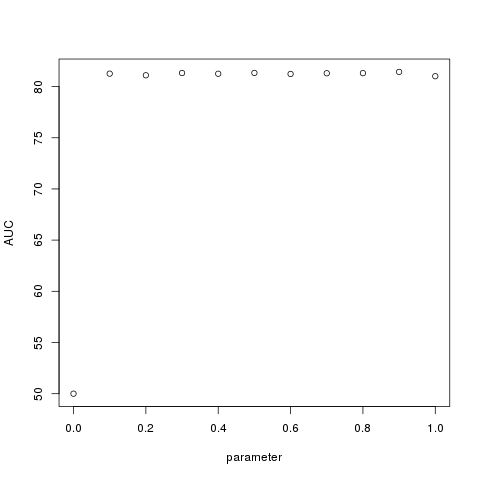
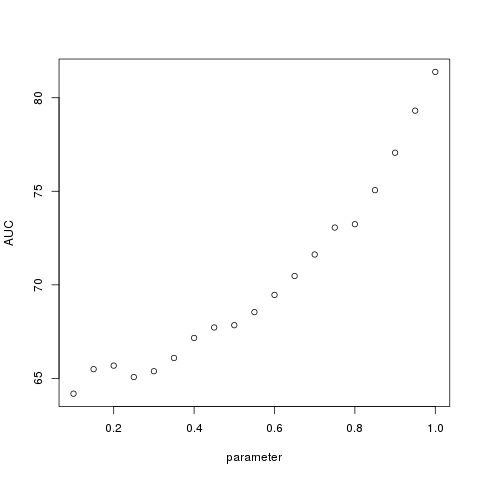
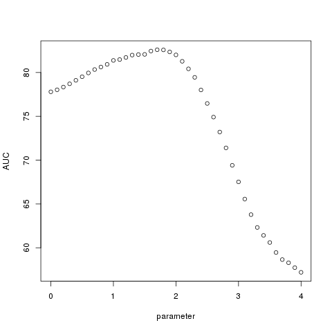
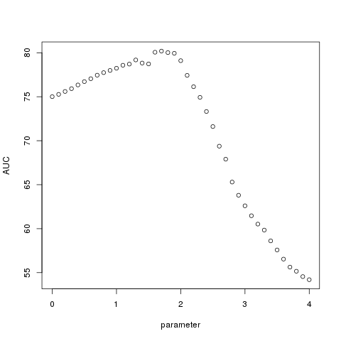
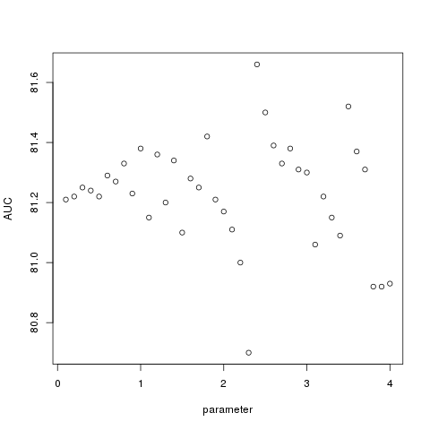
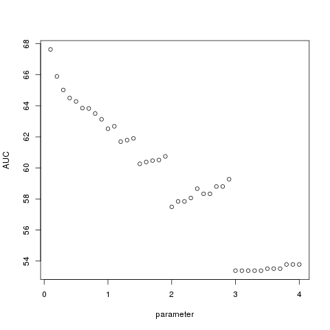
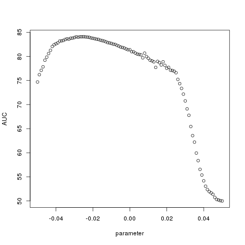
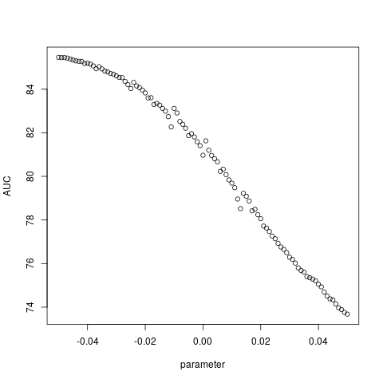
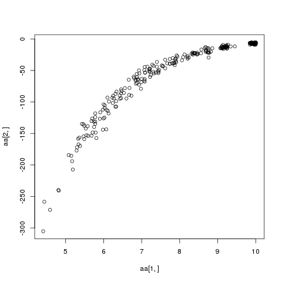

# General Analysis of different type of tree rescaling

## Settings
Testing AUC results when using the option `ALL` in rocCurves, without using any cross validation

## Lambda transformation - Self coding in R


```r
load('comGMPD.RData')
com=unname(com)
phy_dist = unname(phy_dist)
Z= 1*(com>0)
dist = phy_dist
dd = 1/dist
diag(dd)<-0
m = max(dd)
##diag(dd)<-max(dd)
dd1= (dd/max(dd) - 1)%*%Z + Z           # removed circular reference with + Z
Zmc = matrix(colSums(Z), nrow(Z), ncol(Z), byrow=TRUE) - Z # removed circular reference

grid=seq(0,1,0.1)
aux =sapply(grid, function(eta){
    pdist= Zmc/(Zmc + eta*dd1)
    P = 1-exp(-pdist)
    roc = rocCurves(Z=Z, Z_cross= Z, P=P, plot=FALSE, bins=400, all=TRUE)
    tb  = ana.table(Z, Z, roc=roc, plot=FALSE)
    cbind(eta=eta, tb=tb)
    })
        
plot(unlist(aux['eta',]), unlist(aux['tb.auc',]), ylab = 'AUC', xlab='parameter')

```

| Data   | AUC max | Pred all max |
|--------|---------|--------------|
| GMPD   |   81.43 |        0.869 |
| EID-PS |   82.77 |         0.76 |





### Lambda transform using geiger


```r
library(geiger)
load('comGMPD.RData')
tree <- read.tree('../Data/mammals.tre')
tree <- drop.tip(tree, tree$tip.label[!tree$tip.label %in% rownames(com)])
Z= 1*(com>0)

grid=seq(0.1,1,0.05)
aux =sapply(grid, function(eta){
    print(eta)
    phy_dist<- cophenetic(rescale(rescale(tree, "lambda", eta), "depth", depth=1))
    phy_dist = dist_ordering(phy_dist, com)
    dd =1/(phy_dist)
    diag(dd)<-0
    pdist = dd %*% Z
    P = 1-exp(-pdist)
    roc = rocCurves(Z=Z, Z_cross= Z, P=P, plot=FALSE, bins=400, all=TRUE)
    tb  = ana.table(Z, Z, roc=roc, plot=FALSE)
    cbind(eta=eta, tb=tb)
})

png('img/lambda_trans_GMP-geiger.png')
plot(unlist(aux['eta',]), unlist(aux['tb.auc',]), ylab = 'AUC', xlab='parameter')
dev.off()

```

| Data   | AUC max | Pred all max | eta | 
|--------|---------|--------------|-----|
| GMPD   |   81.36 |        0.71 | 1 | 
| EID-PS |   81.38 |         0.71 | 1 |




## Kappa transformation


```r
load('comGMPD.RData')
tree <- read.tree('../Data/mammals.tre')
tree <- drop.tip(tree, tree$tip.label[!tree$tip.label %in% rownames(com)])
Z= 1*(com>0)

grid=seq(0,4,0.1)
aux =sapply(grid, function(eta){
    phy_dist<- cophenetic(rescale(rescale(tree, "kappa", eta), "depth", depth=1))
    phy_dist = dist_ordering(phy_dist, com)
    dd =1/phy_dist
    diag(dd)<-0
    pdist = dd %*%Z
    P = 1-exp(-pdist)
    roc = rocCurves(Z=Z, Z_cross= Z, P=P, plot=FALSE, bins=400, all=TRUE)
    tb  = ana.table(Z, Z, roc=roc, plot=FALSE)
    cbind(eta=eta, tb=tb)
})

png('img/kappa_trans_GMP-geiger.png')
plot(unlist(aux['eta',]), unlist(aux['tb.auc',]), ylab = 'AUC', xlab='parameter')
dev.off()

```


| Data   | AUC max | Pred all max | eta |
|--------|---------|--------------|-----|
| GMPD   |    82.6 |        0.695 | 1.7 |
| EID-PS |   80.19 |         0.73 | 1.7 |





Kappa geiger


## BM transformation


```r
library(geiger)
source('library.R')
load('comGMPD.RData')
tree <- read.tree('../Data/mammals.tre')
tree <- drop.tip(tree, tree$tip.label[!tree$tip.label %in% rownames(com)])

grid=seq(0.1,4,0.1)
Z= 1*(com>0)
aux =sapply(grid, function(eta){
    print(eta)
    phy_dist<- cophenetic(rescale(rescale(tree, "BM", eta), "depth", depth=1))
    phy_dist = dist_ordering(phy_dist, com)
    dd =1/phy_dist
    diag(dd)<-0
    pdist = dd %*% Z
    P = 1-exp(-pdist)
    roc = rocCurves(Z=Z, Z_cross= Z, P=P, plot=FALSE, bins=400, all=TRUE)
    tb  = ana.table(Z, Z, roc=roc, plot=FALSE)
    cbind(eta=eta, tb=tb)
})

png('img/BM_trans_GMP-geiger.png')
plot(unlist(aux['eta',]), unlist(aux['tb.auc',]), ylab = 'AUC', xlab='parameter')
dev.off()
```


| Data   | AUC max | Pred all max | eta |
|--------|---------|--------------|-----|
| GMPD   |    81.66 |        0.71 | 2.4 |




## OU transformation


```r
library(geiger)
source('library.R')
load('comGMPD.RData')
tree <- read.tree('../Data/mammals.tre')
tree <- drop.tip(tree, tree$tip.label[!tree$tip.label %in% rownames(com)])

grid=seq(0.1,4,0.1)
Z= 1*(com>0)
aux =sapply(grid, function(eta){
    print(eta)
    phy_dist<- cophenetic(rescale(rescale(tree, "OU", eta), "depth", depth=1))
    phy_dist = dist_ordering(phy_dist, com)
    dd =1/phy_dist
    diag(dd)<-0
    pdist = dd %*% Z
    P = 1-exp(-pdist)
    roc = rocCurves(Z=Z, Z_cross= Z, P=P, plot=FALSE, bins=400, all=TRUE)
    tb  = ana.table(Z, Z, roc=roc, plot=FALSE)
    cbind(eta=eta, tb=tb)
})

png('img/OU_trans_GMP-geiger.png')
plot(unlist(aux['eta',]), unlist(aux['tb.auc',]), ylab = 'AUC', xlab='parameter')
dev.off()
```




## EB transformation

```r
library(geiger)
source('library.R')
load('comGMPD.RData')
tree <- read.tree('../Data/mammals.tre')
tree <- drop.tip(tree, tree$tip.label[!tree$tip.label %in% rownames(com)])

grid=seq(-.05,0.05,0.001)
Z= 1*(com>0)
aux =sapply(grid, function(eta){
    print(eta)
    phy_dist<- cophenetic(rescale(rescale(tree, "EB", eta), "depth", depth=1))
    phy_dist = dist_ordering(phy_dist, com)
    dd =1/phy_dist
    diag(dd)<-0
    pdist = dd %*% Z
    P = 1-exp(-pdist)
    roc = rocCurves(Z=Z, Z_cross= Z, P=P, plot=FALSE, bins=400, all=TRUE)
    tb  = ana.table(Z, Z, roc=roc, plot=FALSE)
    cbind(eta=eta, tb=tb)
})

png('img/EB_trans_GMP-geiger.png')
plot(unlist(aux['eta',]), unlist(aux['tb.auc',]), ylab = 'AUC', xlab='parameter')
dev.off()

```


| Data   | AUC max | Pred all max | eta |
|--------|---------|--------------|-----|
| GMPD   |    84.09 |        0.77 | -0.025 |





## EB transformation - depth 1000

```r
library(geiger)
source('library.R')
load('comGMPD.RData')
tree <- read.tree('../Data/mammals.tre')
tree <- drop.tip(tree, tree$tip.label[!tree$tip.label %in% rownames(com)])

grid=seq(-.05,0.05,0.001)
Z= 1*(com>0)
aux =sapply(grid, function(eta){
    print(eta)
    phy_dist<- cophenetic(rescale(rescale(tree, "EB", eta), "depth", depth=1000))
    phy_dist = dist_ordering(phy_dist, com)
    dd =1/phy_dist
    diag(dd)<-0
    pdist = dd %*% Z
    P = 1-exp(-pdist)
    roc = rocCurves(Z=Z, Z_cross= Z, P=P, plot=FALSE, bins=400, all=TRUE)
    tb  = ana.table(Z, Z, roc=roc, plot=FALSE)
    cbind(eta=eta, tb=tb)
})

png('img/EB_trans_GMP-geiger_depth1000.png')
plot(unlist(aux['eta',]), unlist(aux['tb.auc',]), ylab = 'AUC', xlab='parameter')
dev.off()

plot(rescale(tree,"depth",depth=1000))

```

EB with tree scaled to depth of 1000




# Testing ICM likelihood for dist only model


```r
load('~/Github/ICM/comGMPD.RData')
tree <- read.tree('~/Github/Data/mammals.tre')
tree <- drop.tip(tree, tree$tip.label[!tree$tip.label %in% rownames(com)])

# Testing all names in hosts in com exist in tree
if(! all(sapply(rownames(com), function(r) r %in% tree$tip.label))) {
		print('Warning! Not all hosts in com exist in tree. Hosts not found in tree will be removed.')
		com <- com[rownames(com)%in%tree$tip.label,]
}

source('library.R')
source('gen.R')
dd = cophenetic(rescale(tree, 'EB', 0))
aux <- sapply(rownames(dd), function(r) which(r==rownames(com)))
com = com[aux,]
Z= unname(com)
Z = 1*(Z>0)
tree = rescale(tree, 'depth',1)

tree.ht = arrange.tree(tree)
grid=seq(0, 10,.01)
aa = sapply(1:nrow(Z), function(i){
aux =sapply(grid, function(eta){
    print(eta)
    pdist.new = cophenetic(eb.phylo(tree, tree.ht, eta))
    pdist.new =1/pdist.new
    diag(pdist.new)<-0
    pdist.new = c(pdist.new[i,]%*% Z)
    U <- rExp.mean(pdist.new)
    U[Z[i,]==0]<-1
    likeli = sum(log(pdist.new)*Z[i,] ) - sum(U*(pdist.new))
    likeli1 = sum(log(pdist.new)*Z[i,] )
    likeli3= -sum(U*(pdist.new))
    c(eta,likeli, likeli1, likeli3, range(pdist.new))
})
aux[,which.max(aux[2,])]

})

png('likei-ICM-distOnly.png')
plot(aa[1,],aa[2,])
dev.off()

> rowMeans(aa)
[1]   7.751422764 -58.544774142 -41.644924361 -16.899849781   0.005214484
[6]   0.356118372

```


